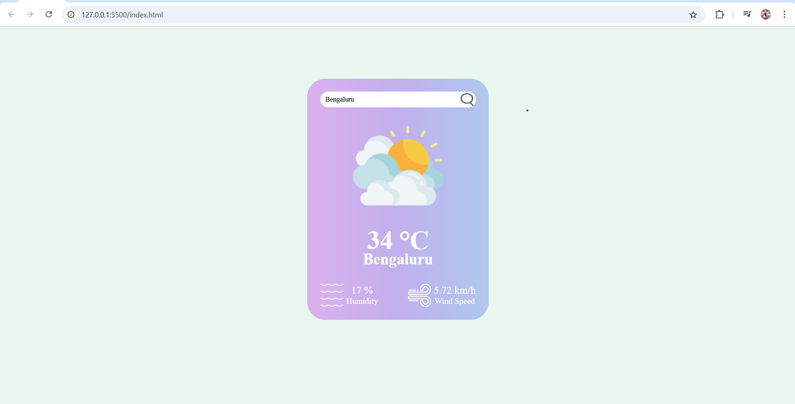

# 🌦️ Weather Web App using Java Script

This is a simple yet elegant weather web application built with **HTML**, **CSS**, and **JavaScript**. It uses the [OpenWeatherMap API](https://openweathermap.org/api) to fetch real-time weather data for any city entered by the user.


---

## 📦 Features

- Real-time weather data
- Dynamic weather icons
- Temperature, wind speed, and humidity display
- Simple and clean UI

---

## 🚀 Getting Started

### 1. Clone the Repository

```bash
git clone https://github.com/yourusername/Weather-Web-App-using-JavaScript.git
cd Weather-Web-App-using-JavaScript
```

Or download the ZIP and extract it.

---

### 2. Get Your API Key from OpenWeatherMap

1. Go to [OpenWeatherMap Sign Up Page](https://home.openweathermap.org/users/sign_up)
2. Create an account.
3. After signing in, go to the **API keys** section.
4. Copy your default key or create a new one.

---

### 3. Configure the API Key

Open the `script.js` file and replace the value of `apikey` with your actual API key.

```js
const apikey = "your_actual_api_key_here";
```

---
## 🛠️ Technologies Used

- HTML5
- CSS3
- JavaScript
- OpenWeatherMap API

---

## 🌐 Live Demo

👉 [Click here to see the Weather Web App live](https://kkabilan07.github.io/Weather-Web-App-using-JavaScript/)

**Note**: This site will show only the User Interface page " Here you cannot see the weather" because in the script.js file the API Key was not given. So get your own free API as mentioned earlier.

---

## 📸 Screenshots



---

## 🤝 Contributing

Feel free to fork the repo, make changes, and submit pull requests. Contributions are welcome!

---

## 📄 License

This project is open source and available under the [MIT License](LICENSE).
